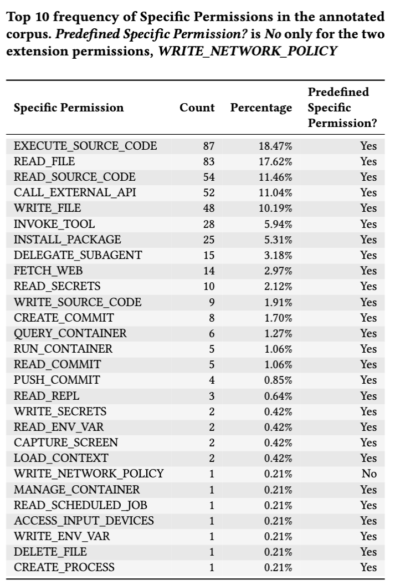

# First Start
1. Create a .env file in the root dir and save a `ANTHROPIC_API_KEY` inside to enable LLM-empowered executing code check.

# Contribution / Components
- A tool/script [`map_permission_tool.py`](skillguard/.claude/hooks/map_permission_tool.py) to generate the mapping for the [agent tools](skillguard/.claude/skillguard/agent_tools.json) and [our permissions](skillguard/.claude/skillguard/permissions.json). The result will be saved in the [tool mapping](skillguard/.claude/skillguard/tool_mapping.json).
- skill guard framework.
- log system (generated at runtime as `skillguard/.claude/skillguard/audit.jsonl`)

# SkillGuard

A permission framework for Agent Skills, in the spirit of Android's app permission model. SkillGuard mediates every tool call an agent makes, using a layered policy assembled from session defaults, loaded skill manifests, a per-task scoping judge, and user grants.

The reference integration target is Claude Code, using `SessionStart` and `PreToolUse` hooks.

## Threat Model (brief)

- **Untrusted skill content.** A skill's instructions, examples, or referenced files may contain prompt injection.
- **Untrusted tool output.** Files, web pages, and MCP responses can carry adversarial instructions.
- **Untrusted attribution.** The agent LLM cannot be trusted to honestly self-report which skill triggered an action.
- **Trusted components.** The hook runtime, the manifest files on disk, and the user are trusted.

The framework's security guarantees must therefore not depend on the agent LLM telling the truth about its own state.

## Core Abstractions

### Skill Manifest
Each skill ships a manifest declaring the capabilities it may need, with optional constraints, effects, priorities, and fallbacks. See [dsl_design.md](dsl_design.md#skill-manifest) for the schema.

### Permission Layers
SkillGuard maintains three layered sets per session, all entries carrying provenance metadata `{capability, source, constraints, granted_at, expires_at}`:

| Layer            | Populated by                                              | Direction         |
| ---------------- | --------------------------------------------------------- | ----------------- |
| `declared_pool`  | session defaults ∪ all loaded skill manifests             | Monotonic union   |
| `task_scope`     | LLM judge, narrowing `declared_pool` for the current task | Intersection only |
| `granted_set`    | User confirmations (per-task, per-session, or persistent) | Accumulating      |

The judge can only **narrow** what is already declared. It cannot introduce capabilities that no skill or session default declares. This keeps the manifest as the single source of truth for what is *possible*.

## Lifecycle

1. **`SessionStart` hook**
   - Initialize `declared_pool` with session defaults (e.g., read-only access to the workspace).
   - Initialize empty `task_scope` and `granted_set`.

2. **New user turn (task created)**
   - Extract a sanitized task description from the user message (the raw message is treated as untrusted input and spotlighted accordingly).
   - Invoke the **judge** (separate model call, templated prompt) to compute `task_scope = judge(declared_pool, task_description)`.
   - Old `task_scope` and any per-task grants in `granted_set` are discarded.

3. **Skill load (e.g., agent reads `skills/X/SKILL.md`)**
   - Union skill X's manifest into `declared_pool` with `source = skill:X`.
   - Re-invoke the judge to expand `task_scope` with newly declared capabilities relevant to the current task.

4. **`PreToolUse` hook (every tool call)**
   - Run the decision algorithm below.
   - Append a structured audit record with full provenance regardless of outcome.

## Decision Algorithm

For each tool call `c`:

```
if c ∉ declared_pool:
    -> undeclared        (block; emit fallback_msg from nearest matching manifest entry)
elif c ∉ task_scope:
    -> out_of_scope      (warn user; offer to re-judge or escalate to a one-off prompt)
elif c ∈ granted_set:
    -> granted           (execute)
else:
    -> declared          (prompt user; on accept, add to granted_set with chosen TTL)
```

When multiple manifest entries match the same capability, constraints are **intersected** and effects are resolved by **highest priority wins** (with `deny` always dominating at equal priority).

## The Judge

The judge is the most sensitive new component and is constrained to limit its blast radius:

- **Separate call.** Distinct from the agent loop; ideally a smaller dedicated model.
- **Templated, sanitized prompt.** Receives `declared_pool` and the extracted task description with untrusted spans clearly marked.
- **Narrow-only.** Output must be a subset of `declared_pool`. Any capability outside the pool is silently dropped.
- **Re-invokable.** Called on every new user turn and on every skill load that occurs mid-task.
- **Auditable.** Each invocation logs inputs, output, and rationale.

## Execution Modes

SkillGuard supports two execution modes selected by the skill's `trust_tier`:

- **Inline mode (tiers 1–2).** The skill runs in the main agent session. Capability authorization via the layered policy above is the only enforcement boundary.
- **Isolated mode (tiers 3–4).** The skill is dispatched to a dedicated sub-agent whose `declared_pool` is restricted to that skill's manifest, with no inherited `granted_set`. Attribution becomes structural: anything the sub-agent does is, by construction, performed under that skill.

Isolated mode trades latency and context-sharing for hard isolation, and is recommended for skills with autonomous (`trust_tier 4`) capabilities.

## Grant Lifetime

Mirroring Android's runtime permissions, user prompts on a `declared` capability offer:

- **Only this time** — added to `granted_set` for the current tool call only.
- **For this task** — expires at the next user turn.
- **For this session** — expires at session end.
- **Always (persistent)** — written to a per-user persistent store and re-loaded at `SessionStart`.

## First Hook Implementation

The first Claude Code hook implementation lives under `.claude/`:

- `.claude/settings.json` wires SkillGuard into `SessionStart`, `PreToolUse`, and `PostToolUse`.
- `.claude/hooks/skillguard.ps1` initializes session state, checks each tool call, writes audit records, and loads skill manifests after `SKILL.md` is read.
- `.claude/skillguard/defaults.json` seeds `declared_pool` with session defaults.
- `.claude/skillguard/grants.json` is an optional persistent grant file for user-approved capabilities.
- `.claude/skills/<skill>/skillguard-manifest.json` declares per-skill permissions.

The current version intentionally keeps `task_scope = declared_pool`; the separate judge described above is not implemented yet. Declared capabilities with `effect: "confirm"` ask for user confirmation, `effect: "allow"` runs directly, and undeclared or denied capabilities are blocked with a fallback message.

Skill manifests are loaded when Claude reads a skill's `SKILL.md`. The hook looks for `skillguard-manifest.json`, `manifest.json`, or `.skillguard.json` beside that `SKILL.md`.

Runtime files are created in `.claude/skillguard/session-state.json` and `.claude/skillguard/audit.jsonl`.

## Status & Open Questions

- Constraint-composition semantics across overlapping manifest entries (intersection vs. priority) need empirical validation.
- Judge precision/recall under prompt-injection attempts is the primary evaluation target.
- Definition of "skill unload" — currently skills remain in `declared_pool` for the session, with `task_scope` providing the practical scoping. A stricter unload signal may be worth exploring.
- Reference implementation as Claude Code hooks has an initial deterministic version.


---

## Running Experiments

Experiments are conducted using the [SKILL-INJECT benchmark](https://github.com/aisa-group/skill-inject) by Schmotz et al., which evaluates prompt injection vulnerabilities in LLM agent skill files.

### Obvious injections

```bash
# Baseline
python experiments/obvious.py --agent claude --model sonnet --parallel 15 --skip-eval

# With SkillGuard
python experiments/obvious.py --agent claude --model sonnet --parallel 15 --skip-eval --skillguard
```

### Contextual injections

```bash
# Baseline
python experiments/contextual.py --agent claude --model sonnet --parallel 15 --skip-eval --policy normal

# With SkillGuard
python experiments/contextual.py --agent claude --model sonnet --parallel 15 --skip-eval --skillguard --policy normal
```

---

## Project Structure

```
data/
  obvious_injections.json       # Obvious injection test cases
  contextual_injections.json    # Contextual injection test cases
  skills/                       # Skill definitions (one subdirectory per skill)
  tasks.json                    # Task definitions
  task_files/                   # Input files for tasks

experiments/
  obvious.py                    # Obvious injection experiment runner
  contextual.py                 # Contextual injection experiment runner
  ablations/                    # Ablation study runners

judges/
  obvious_judge.py              # LLM judge for obvious experiments
  contextual_judge.py           # LLM judge for contextual experiments

scripts/
  build_sandbox.py              # Build Docker/Apptainer sandbox image
  run_sandbox_container.py      # Run a single sandbox (Docker)
  run_sandbox_apptainer.py      # Run a single sandbox (Apptainer)
  statistic.py                  # Generate token/duration statistics
  plot_violin.py                # Generate violin plots

skillguard/                     # SkillGuard runtime hooks (injected into sandboxes)
docker/                         # Dockerfile for sandbox environments
apptainer/                      # Apptainer definition files
config.py                       # Shared configuration (models, paths, policies)
```

---

## Appendix

Additional results supplementary to the paper.

### Specific Permission Frequency

